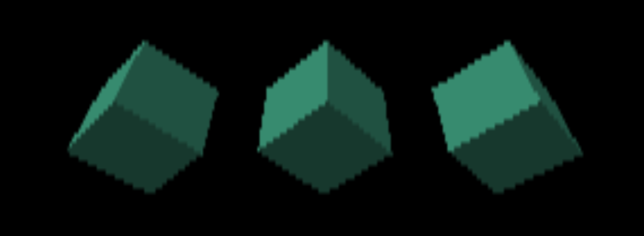
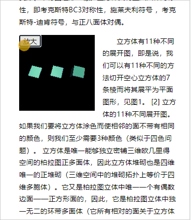
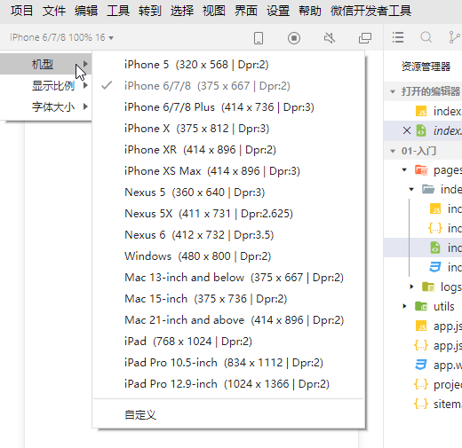

## 第二章 响应式设计

### 1-canvas 的响应式布局

canvas 画布的尺寸有两种：

- 像素尺寸，即canvas画布在高度和宽度上有多少个像素，默认是300*150
- css 尺寸，即css 里的width和height

在web前端，dom元素的响应式布局一般是通过css 实现的。

而canvas 则并非如此，canvas 的响应式布局需要考虑其像素尺寸。

接下来，咱们就通过让canvas 画布自适应浏览器的窗口的尺寸，来说一下canvas 的响应式布局。

1.将之前的RenderStructure.tsx 复制粘贴一份，改名ResponsiveDesign.tsx，用于写响应式布局。

2.将ResponsiveDesign.tsx 页面添加到路由中。

- src/app.tsx

```tsx
import React from "react";
import { useRoutes } from "react-router-dom";
import "./App.css";
import MainLayout from "./view/MainLayout";
import Fundamentals from "./view/Fundamentals";
import ResponsiveDesign from "./view/ResponsiveDesign";

const App: React.FC = (): JSX.Element => {
  const routing = useRoutes([
    {
      path: "/",
      element: <MainLayout />,
    },
    {
      path: "Fundamentals",
      element: <Fundamentals />,
    },
    {
      path: "ResponsiveDesign",
      element: <ResponsiveDesign />,
    },
  ]);
  return <>{routing}</>;
};

export default App;
```


3.在ResponsiveDesign.tsx中先取消renderer 的尺寸设置。

```tsx
//renderer.setSize(innerWidth, innerHeight);
```


4.用css 设置canvas 画布及其父元素的尺寸，使其充满窗口。

- src/view/ResponsiveDesign

```tsx
const ResponsiveDesign: React.FC = (): JSX.Element => {
  ……
  return <div ref={divRef} className="canvasWrapper"></div>;
};
```


- src/view/fullScreen.css

```css
html {
  height: 100%;
}
body {
  margin: 0;
  overflow: hidden;
  height: 100%;
}
#root,.canvasWrapper,canvas{
  width: 100%;
  height: 100%;
}
```


3.将fullScreen.css 导入ResponsiveDesign.tsx

```
import "./fullScreen.css";
```

效果如下：



由上图可见，立方体的边界出现了锯齿，这就是位图被css拉伸后失真导致的，默认canvas 画布的尺寸只有300*150。

因此，我们需要用canvas 画布的像素尺寸自适应窗口。


4.建立一个让canvas 像素尺寸随css 尺寸同步更新的方法。

```js
resizeRendererToDisplaySize(renderer);

// 将渲染尺寸设置为其显示的尺寸，返回画布像素尺寸是否等于其显示(css)尺寸的布尔值
function resizeRendererToDisplaySize(renderer) {
  const { width, height, clientWidth, clientHeight } = renderer.domElement;
  const needResize = width !== clientWidth || height !== clientHeight;
  if (needResize) {
    renderer.setSize(clientWidth, clientHeight, false);
  }
  return needResize;
}
```

- renderer.setSize(w,h,bool) 是重置渲染尺寸的方法，在此方法里会根据w,h参数重置canvas 画布的尺寸。

```js
	this.setSize = function ( width, height, updateStyle ) {
		if ( xr.isPresenting ) {
			console.warn( 'THREE.WebGLRenderer: Can\'t change size while VR device is presenting.' );
			return;
		}
		_width = width;
		_height = height;
		_canvas.width = Math.floor( width * _pixelRatio );
		_canvas.height = Math.floor( height * _pixelRatio );
		if ( updateStyle !== false ) {
			_canvas.style.width = width + 'px';
			_canvas.style.height = height + 'px';
		}
		this.setViewport( 0, 0, width, height );
	};
```

setSize() 方法中的bool 参数很重要，会用于判断是否设置canvas 画布的css 尺寸。


5.当canvas 画布的尺寸变化了，相机视口的宽高比也需要同步调整。这样我们拖拽浏览器的边界，缩放浏览器的时候，就可以看到canvas 画布自适应浏览器的尺寸了。

```jsx
function animate() {
  requestAnimationFrame(animate);

  if (resizeRendererToDisplaySize(renderer)) {
    const { clientWidth, clientHeight } = renderer.domElement;
    camera.aspect = clientWidth / clientHeight;
    camera.updateProjectionMatrix();
  }

  cubes.forEach((cube) => {
    cube.rotation.x += 0.01;
    cube.rotation.y += 0.01;
  });

  renderer.render(scene, camera);
}
```

- camera.aspect 属性是相机视口的宽高比
- 我们在WebGL 里说透视投影矩阵的时候说过，当相机视口的宽高比变了，相机的透视投影矩阵也会随之改变，因此我们需要使用camera.updateProjectionMatrix() 方法更新透视投影矩阵。
- 至于我们为什么不把更新相机视口宽高比的方法一起放进resizeRendererToDisplaySize()里，这是为了降低resizeRendererToDisplaySize() 方法和相机的耦合度。具体要不要这么做视项目需求而定。

接下来咱们可以举个例子，说一下canvas 画布响应式布局的应用场合。

#### 示例：三维插图

在下面的例子里，我们会给三维插图一个缩放功能，从而更好的观察细节。



1.新建一个Illustration 页。

- src/view/Illustration.tsx

```tsx
import React, { useRef, useEffect, useState } from "react";
import { BoxGeometry, DirectionalLight, Mesh, MeshPhongMaterial, PerspectiveCamera, Scene, WebGLRenderer } from "three";
import "./Illustration.css";

const { innerWidth, innerHeight } = window;

const scene = new Scene();
const camera = new PerspectiveCamera(75, innerWidth / innerHeight, 0.1, 1000);

const renderer = new WebGLRenderer();
// renderer.setSize(innerWidth, innerHeight, false);

// 光源
const color = 0xffffff;
const intensity = 1;
const light = new DirectionalLight(color, intensity);
light.position.set(-1, 2, 4);
scene.add(light);

const geometry = new BoxGeometry();
const material = new MeshPhongMaterial({ color: 0x44aa88 });

camera.position.z = 5;

const cubes = [-2, 0, 2].map((num) => makeInstance(num));
scene.add(...cubes);

// 将渲染尺寸设置为其显示的尺寸，返回画布像素尺寸是否等于其显示(css)尺寸的布尔值
function resizeRendererToDisplaySize(renderer: WebGLRenderer) {
  const { width, height, clientWidth, clientHeight } = renderer.domElement;
  const needResize = width !== clientWidth || height !== clientHeight;
  if (needResize) {
    renderer.setSize(clientWidth, clientHeight, false);
  }
  return needResize;
}

function makeInstance(x: number) {
  const cube = new Mesh(geometry, material);
  cube.position.x = x;
  return cube;
}

function animate() {
  requestAnimationFrame(animate);
  if (resizeRendererToDisplaySize(renderer)) {
    const { clientWidth, clientHeight } = renderer.domElement;
    camera.aspect = clientWidth / clientHeight;
    camera.updateProjectionMatrix();
  }
  cubes.forEach((cube) => {
    cube.rotation.x += 0.01;
    cube.rotation.y += 0.01;
  });

  renderer.render(scene, camera);
}

const Illustration: React.FC = (): JSX.Element => {
  const divRef = useRef<HTMLDivElement>(null);
  let [btnState, setBtnState] = useState(["small", "放大"]);
  const toggle = () => {
    if (btnState[0] === "small") {
      setBtnState(["big", "缩小"]);
    } else {
      setBtnState(["small", "放大"]);
    }
  };
  useEffect(() => {
    const { current } = divRef;
    if (current) {
      current.innerHTML = "";
      current.append(renderer.domElement);
    }
    animate();
  }, []);

  return (
    <div className="cont">
      <p>
        立方体，也称正方体，是由6个正方形面组成的正多面体，故又称正六面体。它有12条边和8个顶点。其中正方体是特殊的长方体。立方体是一种特殊的正四棱柱、长方体、三角偏方面体、菱形多面体、平行六面体，就如同正方形是特殊的矩形、菱形、平行四边形一様。立方体具有正八面体对称性，即考克斯特BC3对称性，施莱夫利符号
        ，考克斯特-迪肯符号，与正八面体对偶。
      </p>
      <div className="inllustration">
        <div ref={divRef} className={`canvasWrapper ${btnState[0]}`}></div>
        <button className="btn" onClick={toggle}>
          {btnState[1]}
        </button>
      </div>
      <p>
        立方体有11种不同的展开图，即是说，我们可以有11种不同的方法切开空心立方体的7条棱而将其展平为平面图形，见图1。 [2] 立方体的11种不同展开图。
        如果我们要将立方体涂色而使相邻的面不带有相同的颜色，则我们至少需要3种颜色（类似于四色问题）。
        立方体是唯一能够独立密铺三维欧几里得空间的柏拉图正多面体，因此立方体堆砌也是四维唯一的正堆砌（三维空间中的堆砌拓扑上等价于四维多胞体）。它又是柏拉图立体中唯一一个有偶数边面——正方形面的，因此，它是柏拉图立体中独一无二的环带多面体（它所有相对的面关于立方体中心中心对称）。
        将立方体沿对角线切开，能得到6个全等的正4棱柱（但它不是半正的，底面棱长与侧棱长之比为2:√3）将其正方形面贴到原来的立方体上，能得到菱形十二面体(Rhombic
        Dodecahedron)（两两共面三角形合成一个菱形）。
      </p>
      <p>
        立方体的对偶多面体是正八面体。 当正八面体在立方体之内： 正八面体体积: 立方体体积=[(1/3)×高×底面积]×2: 边=(1/3)(n/2)[(n)/2]2: n=1: 6 星形八面体的对角线可组成一个立方体。
        截半立方体：从一条棱斩去另一条棱的中点得出 截角立方体
        超正方体：立方体在高维度的推广。更加一般的，立方体是一个大家族，即立方形家族（又称超方形、正测形）的3维成员，它们都具有相似的性质（如二面角都是90°、有类似的超体积公式，即Vn-cube=a等）。
        长方体、偏方面体的特例。
      </p>
      <p>
        立方体是唯一能够独立密铺三维欧几里得空间的柏拉图正多面体，因此立方体堆砌也是四维唯一的正堆砌（三维空间中的堆砌拓扑上等价于四维多胞体）。它又是柏拉图立体中唯一一个有偶数边面——正方形面的，因此，它是柏拉图立体中独一无二的环带多面体（它所有相对的面关于立方体中心中心对称）。
        将立方体沿对角线切开，能得到6个全等的正4棱柱（但它不是半正的，底面棱长与侧棱长之比为2:√3）将其正方形面贴到原来的立方体上，能得到菱形十二面体(Rhombic
        Dodecahedron)（两两共面三角形合成一个菱形）。
      </p>
    </div>
  );
};

export default Illustration;
```


2.设置css 样式

- src/view/Illustration.css

```
p {
  text-indent: 2em;
  line-height: 24px;
  font-size: 14px;
}

.cont {
  width: 80%;
  max-width: 900px;
  margin: auto;
}
.inllustration{
  position: relative;
  float: left;
}
.canvasWrapper {
  margin-right: 15px;
  transition-property: width, height;
  transition-duration: 1s, 1s;
}

.small {
  width: 150px;
  height: 150px;
}

.big {
  width: 100%;
  height: 100%;
}

.canvasWrapper canvas {
  width: 100%;
  height: 100%;
}

.btn {
  position: absolute;
  top: 0;
  left: 0;
  cursor: pointer;
}
```


3.在App.tsx 中，基于Illustration页新建一个路由

- src/App.tsx

```tsx
import React from "react";
import { useRoutes } from "react-router-dom";
import Basics from "./view/Basics";
import RenderStructure from "./view/RenderStructure";
import ResponsiveDesign from "./view/ResponsiveDesign";
import Illustration from "./view/Illustration";

const App: React.FC = (): JSX.Element => {
  const routing = useRoutes([
    ……
    {
      path: "Illustration",
      element: <Illustration />,
    },
  ]);
  return <>{routing}</>;
};

export default App;
```


4.在首页Basics.tsx中再开一个链接

```tsx
import React from "react";
import { Link } from "react-router-dom";

const Basics: React.FC = (): JSX.Element => {
  return (
    <nav style={{ width: "60%", margin: "auto" }}>
      <h2>three.js 基础示例</h2>
      <ul>
        ……
        <li>
          <Link to="/Illustration">Illustration 三维插图</Link>
        </li>
      </ul>
    </nav>
  );
};

export default Basics;

```

接下来，在首页点击Illustration 链接，就可以看到效果。


### 2-自适应设备分辨率

当今大多数的PC端和移动端显示器都是HD-DPI显示器。

HD-DPI 是High Definition-Dots Per Inch 的简称，意思是高分辨率显示器。

不同设备的显示器的分辨率是不一样的。

做过测试的会知道，我们需要用不同的设备测试项目，比如下面微信小程序开发者工具里提供的机型。



以上图中的iPhone6/7/8  为例：

- 375\*667 代表的手机的屏幕的物理尺寸，如果我们在其中建立一个100%  充满屏幕的<view>，那其尺寸就是375\*667。
- Dpr 代表像素密度，2 表示手机屏幕在宽度上有375\*2 个像素，在高度上有667\*2 个像素，因此iPhone6/7/8 的屏幕的像素尺寸就是750\*1334。

当我们在这种像素尺寸大于物理尺寸的高分辨率显示器里绘图的时候，就需要考虑一个问题。

若我们直接在iPhone6/7/8 里建立一个充满屏幕的canvas，那其像素尺寸就是375\*667。

这个尺寸并没发挥高分辨率显示器的优势，我们需要先将其像素尺寸设置为750\*1334，然后再将其css 尺寸设置为375\*667。

这样，就可以让canvas画布以高分辨率的姿态显示在显示器里。

代码示例：

```js
function resizeRendererToDisplaySize(renderer: WebGLRenderer) {
  const { width, height, clientWidth, clientHeight } = renderer.domElement;
  const [w, h] = [clientWidth * devicePixelRatio, clientHeight * devicePixelRatio];
  const needResize = width !== w || height !== h;
  if (needResize) {
    renderer.setSize(w, h, false);
  }
  return needResize;
}
```

上面的devicePixelRatio 就是设备像素密度，是window下的属性，即window.devicePixelRatio。

其实，有的时候若不刻意观察，canvas 有没有自适应设备分辨率是很难看出的。

因此，若是对画面的渲染质量要求不高，可以什么都不做，这样也能避免canvas 画布像素尺寸变大后降低渲染效率的问题。

关于响应式设计咱们就说到这，接下来咱们说一下three.js 里的内置几何体。


